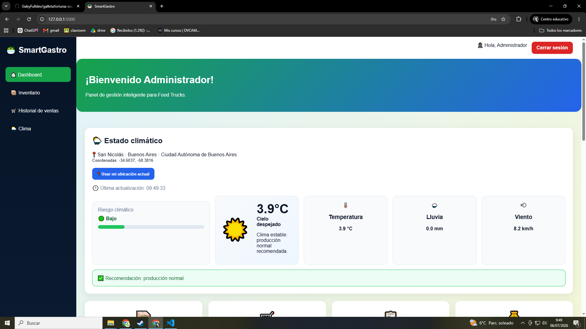
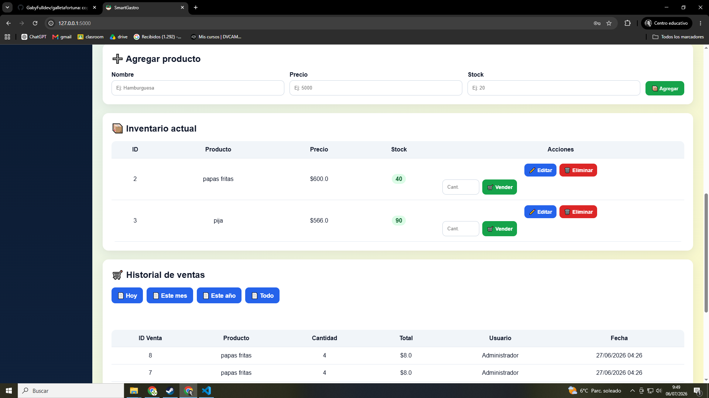

# 🍽️ SmartGastro

Sistema de gestión gastronómica desarrollado como proyecto académico. Permite administrar clientes, productos y pedidos mediante una interfaz intuitiva, integrando una API REST desarrollada con Flask y una aplicación de escritorio realizada con Tkinter.

## 📸 Capturas

### Pantalla Principal



### Gestión del Sistema



---

## 🚀 Tecnologías Utilizadas

- Python 3
- Flask
- Tkinter
- SQLite
- SQLAlchemy
- HTML5
- CSS3
- Bootstrap
- Arquitectura en capas
- API REST
- Programación Orientada a Objetos (POO)

---

## ✨ Funcionalidades

- Inicio de sesión.
- Gestión de clientes.
- Gestión de productos.
- Gestión de pedidos.
- API REST para operaciones CRUD.
- Base de datos SQLite.
- Interfaz gráfica con Tkinter.
- Validaciones de datos.
- Arquitectura organizada por capas.

---

## 📂 Estructura del Proyecto

```
SmartGastro/
│
├── app/
├── static/
├── templates/
├── tp/
│   └── images/
│       ├── 1.png
│       └── 2.png
├── instance/
├── requirements.txt
├── run.py
└── README.md
```

---

## ⚙️ Instalación

1. Clonar el repositorio.

```bash
git clone https://github.com/tuusuario/SmartGastro.git
```

2. Ingresar al proyecto.

```bash
cd SmartGastro
```

3. Instalar dependencias.

```bash
pip install -r requirements.txt
```

4. Ejecutar la aplicación.

```bash
python run.py
```

---

## 👨‍💻 Autor

**Gabriel Toledo**

Proyecto desarrollado con fines educativos para la carrera de Analista de Sistemas.
